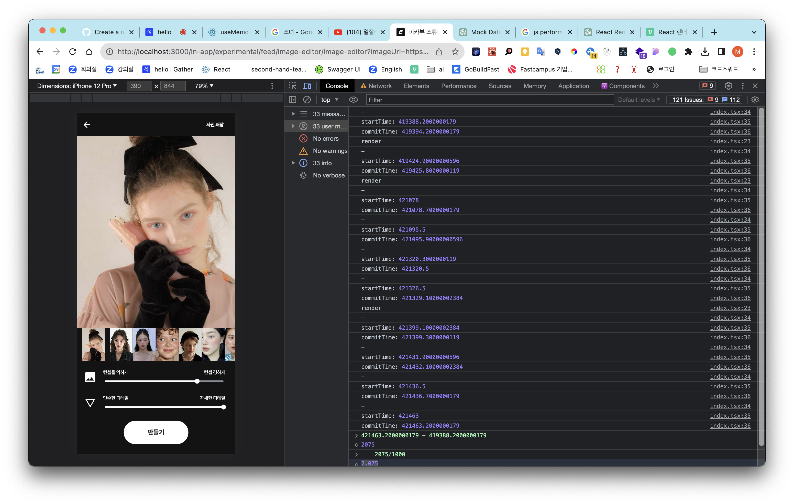

# 제작 배경

스튜디오 피카부는 자신을 닮은 AI 이미지를 생성해주는 에디터이다. 내가 일을 할 당시 회사의 가장 큰 미션은 기존 유저의 리텐션을 올리는 것이었다.

리텐션 지표의 선행 지표는 여러가지가 있었지만, 그중에서도 사진에 대한 유저의 만족도를 해결하는 것을 개선하는 것을 목표로 잡기로 했다. 블로그 리뷰, 앱 리뷰 등을 통해 유저는 '사진이 자신을 닮지 않았다'라는 의견이 가장 많다는 사실을 파악할 수 있었다.

그런데 기존에 진행했던 유저 리서치 경험을 들어보니 사진에 대한 만족도를 결정하는 데에는 여러가지 변수가 존재했다. 닮은 것도 중요하지만, 또 예쁘지 않으면 쓰지 않을 것이라는 의견이 있었다고 한다.

원래의 UX는 닮은 정도를 조정하는 수치를 일정 구간 안에서 랜덤하게 선택하여 여러 장을 생성해주는 것이었다. '사용자가 직접 수치를 조절하면 사진에 대한 만족도가 올라갈 것이다' 라는 가설을 세우고, 이 가설을 검증하기 위해 AI 이미지 에디터를 제작하게 되었다.

이 AI 이미지 에디터를 만들면서 버그를 해결하며, 특히 렌더링을 최적화 했던 경험에 대해 공유하고자 한다.

# 문제 해결

## 1. 이미지 목록의 이미지가 깜박이는 현상

### 문제

이미지를 선택할 때마다 이미지 목록의 이미지가 깜박이는 현상이 있었다. 확인해보니, 이미지를 새로 선택할 때마다 전체 페이지가 재렌더링되고 있었다. 특히 앱으로 확인했을 때 렌더링 속도가 매우 느렸다.


### 원인 찾기

리액트 디버깅 툴을 열고 리렌더링이 되고 있는 위치를 확인했고, 페이지 전체가 리렌더링되고 있음을 확인했다. 확인해야 할 코드가 페이지 컴포넌트로 좁혀졌다.

```jsx
export const FeedImageEditorPage = () => {
	...
	const initialImageUrl = useMemo(
		() => getImageKitUrl(selectedMagazine?.imageUrl as string),
		[selectedMagazine],
	)

	return (
	<>
	<InAppLayout key={initialImageUrl}
	...
	</>
```

찾고나니 너무 간단한 문제였다. key 를 받고 있어서 렌더링이 두번 되고 있었다.

리액트는 동일한 컴포넌트여도 key가 달라지면 다른 element로 인식하게 되어 재렌더를 시도하게 된다. 위와 같은 상황의 경우 initialImageUrl이 변경될 때마다 key 값이 변경되게 되었던 것이다.

## 문제 해결

key를 삭제하니 더이상 깜박임 현상이 일어나지 않았다. 게다가 성능을 측정해본 결과, mid-tier mobile 기준 99% 가량 리렌더링 속도가 감소했다.

| Before  | After   |
| ------- | ------- |
| 2.075초 | 0.009초 |



## 성능 측정 방법

성능 측정은 React에서 제공하는 `<Profiler>` 라는 성능 측정을 돕는 컴포넌트를 사용해 측정하였다. onRender에 callback 함수를 넣어주고, startTime과 commitTime이라는 파라미터를 이용해 렌더가 시작된 시간부터 렌더가 종료된 시간까지를 계산하였다.

```jsx
const onRenderCallback = (startTime: number, commitTime: number) => {
  console.log("-")
  console.log("startTime:", startTime)
  console.log("commitTime:", commitTime)
}

<Profiler id="ImageHistoryContainer" onRender={onRenderCallback}>
  ...
</Profiler>
```

## 2. 스크롤 위치 초기화 막기

### 문제

새로운 사진을 선택할 때마다 스크롤이 초기화되는 문제가 있었다. 원인을 파악해보니 클릭과 동시에 컴포넌트 리렌더링이 일어나 스크롤이 초기화되고 있었다.

### 시도 1. 스크롤 위치 저장해보기

처음에는 기존 스크롤 위치 상태를 저장하고, 그 상태를 렌더링마다 호출하여 문제를 해결하려 했다. 하지만 상태가 매번 저장되어야 했고, 또 계산에 들어가는 시간도 많이 걸렸다.

아래는 스크롤 위치를 저장해보려 했던 시도. 확실히 코드에서 안좋은 냄새가 나고 있다 👃

```jsx
const saveContainerScrollPosition = () => {
  const scrollPosition = wrapRef.current?.scrollLeft
  setImageContainerScrollPosition(scrollPosition ?? 0)
}
```

### 시도 2. scrollIntoView method 사용하기

좀 더 간단한 방법을 찾다, 아래의 코드 샌드박스를 발견하게 되었다. 아래의 코드를 실행시켜보면 버튼을 클릭하면 특정 사진의 가운데 좌표로 스크롤이 이동한다. 이 좌표가 어디인지 계산하는 것은 scrollIntoView라는 method 내부에서 이루어져, 수동으로 스크롤 위치를 계산할 필요가 없었다.

https://codesandbox.io/s/ddffoy?file=/App.js&utm_medium=sandpack


## scrollIntoView?

scrollIntoView는 HTML Element method로 해당 element를 기준으로 스크롤을 이동시켜주는 역할을 한다.

아래의 코드에서 확인할 수 있듯이, 파라미터로 behavior, block, inline이라는 항목을 받는다. 파라미터의 역할은 다음과 같다.

- behavior: 애니메이션 속성을 지정할 수 있다.
- block: 수직 정렬을 결정한다.
- inline: 수평 정렬을 결정한다.

따라서 다음과 같이 코드를 수정했다. selectMagazine 을 변경하는 즉시 flushSync를 통해 강제로 렌더링을 한다. 그 후 selectedRef에 접근, 해당 컴포넌트를 기준 삼아 스크롤이 즉각 이동하게 함으로 문제를 해결했다.

```jsx
...
const handleOnClick = ({ currentTarget }: MouseEvent) => {
	const targetElement = currentTarget as HTMLDivElement
	const targetMagazine = userListItems.find((item) => item.id === targetElement.id)
	if (!targetMagazine) {
		return
	}

	flushSync(() => {
		setSelectedMagazine(targetMagazine)
	})

	selectedRef.current?.scrollIntoView({
		behavior: 'instant',
		block: 'nearest',
		inline: 'center',
	})

}

return (
<Profiler
id="ImageHistoryContainer"
onRender={onRenderCallback}
>
	<S.Wrap ref={wrapRef}>
		<S.Container ref={containerRef}>
		{userListItems.map((item: Magazine, i: number) => (
			<ImageHistoryElement
				isSelected={selectedMagazine?.id === item.id}
				updateSelectedMagazine={updateSelectedMagazine}
				id={item.id}
				key={`${item.id}_${i}`}
				url={item.imageUrl}
				ref={selectedMagazine?.id === item.id ? selectedRef : null}
				saveContainerScrollPosition={saveContainerScrollPosition}
				handleOnClick={handleOnClick}
>			</ImageHistoryElement>
			))}
			<S.ObserverTarget ref={setTarget}></S.ObserverTarget>
			{loading && <S.LoadingContainer></S.LoadingContainer>}
		</S.Container>
	</S.Wrap>
</Profiler>

)
```

최종적으로 개선된 코드를 적용한 화면. 더 이상 불필요한 리렌더링이 일어나지 않고, 발생했던 버그도 개선되었다.


# 배운 점

1. 아쉽게도 기능을 런칭한 이후 사용자 만족도 변화를 추적해보았을 때 유의미하게 좋아지지 못했다. 여러가지 원인이 있었겠지만 우선 기술적인 한계가 컸다. 유저는 수치를 변경할 때마다 수치가 적용된 이미지를 확인하기를 원했다. 하지만 수치를 변경할 때마다 AI 이미지 생성을 하려면 변경될 때마다 AI 이미지 생성에 대한 금액을 부과해야 했다. 한꺼번에 여러 장의 이미지를 얻어 비교할 수 있는 기존의 UX가 더 올바른 방향이라는 결론을 내릴 수 있었다.
2. 피카부 스튜디오를 운영하는 팀러너스라는 회사는 하루에도 수십개의 배포가 일어날 정도로 빠른 조직이다. 사용자의 피드백이 오는 즉시 기능에 반영된다. 때문에 확정된 줄 알았던 기획이 여러 번 변경되는 것을 경험했다. 이러한 조직에서 적응하려면 여러 변경에 대응할 수 있도록 유연하게 짜야 하는구나 하는 것을 느꼈다. 예를 들어, 중간에 사용자 피드백을 받아 슬라이더의 기준점이 뒤바뀐 상황이 있었는데 그 부분을 고려하지 않고 짜서 로직이 복잡해졌다.
3. 에디터라는 자체가 사용자가 빠른 반응성을 기대하는 기능이기 때문에 최적화에 대해 깊이 고민해볼 수 있는 기회가 되었다. 특히, 웹에서 테스트하는 것과 다르게 모바일에서는 앱의 반응속도가 훨씬 느렸다. 실제 환경에서 테스트를 해보는 것의 중요성을 깨달을 수 있었다.
