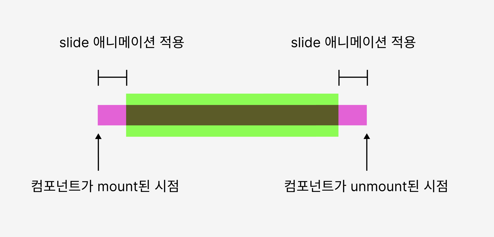

# 배경
우리 팀은 불필요한 element가 돔에 노출되지 않도록 Dynamic Portal을 구현하였다. Dynamic Portal이란 특정 Dialog가 필요한 순간에만 Dynamic하게 element를 돔에 올리는 것을 뜻한다. Dynamic Portal를 구현한 내용은 아래 링크에서 확인할 수 있다.

[https://pocoding.tistory.com/117](https://pocoding.tistory.com/117)


# 문제점
이 Dynamic Portal 이 발생시킨 문제점이 하나가 있었는데, 그건 바로 카테고리 모달의 애니메이션 적용이다. 슬라이드 애니메이션이 발생하려면 이미 해당 element가 돔에 존재해야 하는데, Dynamic Portal을 적용하게 되면 element가 없었다가 생기기 떄문에 애니메이션이 적용될 시간이 확보되지 못했다. 따라서 위와 같이 임시방편으로 돔에 element를 미리 심어두게 되었다. 

위와 같은 상황을 근본적으로 해결하고, Dynamic Portal의 도입 취지를 살리기 위해 리팩토링을 진행하였다.

# 애니메이션 적용 시점을 찾자
결국 중요한 것은 어느 시점에 애니메이션을 호출할 것인가다. 아래와 같이 단계를 나누어 이벤트 시점을 분리해보았다.

1. 컴포넌트 mount
2. 등장 애니메이션 시작
3. 등장 애니메이션 종료
4. 해제 애니메이션 시작
5. 해제 애니메이션 종료
6. 컴포넌트 unmount



그러면 명확해졌다. 이제 각 단계를 코드로 표현하는 일만이 남았다.

1. 컴포넌트 mount 및 등장 애니메이션
setTimeout을 통한 비동기 처리를 이용해 mount 이후 시점에 애니메이션이 추가되도록 처리했다.
```jsx
useEffect(() => {
	slide && modalDiv.current.classList.add('slide-' + slide);
	setTimeout(() => {
		modalDiv.current.classList.add('open'); // 비동기 처리를 하여 mount 이후 시점에 애니메이션이 추가되도록 처리
	}, 0);
}, []);
```

2. 해제 애니메이션 및 컴포넌트 unmount
등장 애니메이션 시점과는 다르게, 기존에 존재하는 메소드를 이용해 cleanup 직전 시점을 알아내는 것은 불가능하였다. 따라서 부모 컴포넌트로부터 닫히기 직전 시점을 수동으로 알려줄 수 있도록 flag 상태를  Portal에 전달하게끔 작성하였다.

```jsx
// Portal 상위 컴포넌트의 코드
...
<Button
title="뒤로"
isWidthFitContent={true}
shape="ghost"
color="neutralText"
icon="arrowLeft"
onClick={() => {
	setBeforeUnmountFlag(true); // 애니메이션이 시작되어야함을 알려준다.
}}
></Button>
...

// Portal 의 코드
useEffect(() => {
	if (!beforeUnmountFlag) return;
	modalDiv.current.classList.remove('open'); // beforeUnmountFlag가 true일 경우 해제 애니메이션을 촉발한다.
	modalDiv.current.addEventListener('transitionend', () => { // 애니메이션이 종료되면 컴포넌트를 해제하는 상태인 Open 을 false로 변경, setBeforeUnmountFlag도 초기화해준다. 
		setOpen && setOpen(false);
		setBeforeUnmountFlag && setBeforeUnmountFlag(false);
	});
}, [beforeUnmountFlag]);
```

완성된 코드는 다음과 같다.

```jsx
import React, { useEffect, useLayoutEffect, useMemo, useRef } from 'react';
import { createPortal } from 'react-dom';
import * as S from './PortalStyle';

export const Portal = ({
id,
children,
slide,
setOpen,
beforeUnmountFlag,
setBeforeUnmountFlag,
}: PortalProps): React.ReactPortal => {
	const modalDiv = useRef(
	document.getElementById(id) || document.createElement('div')
	);
	
	const dynamicDiv = !modalDiv.current.parentElement;
	
	useEffect(() => {
		if (dynamicDiv) {
			modalDiv.current.id = id;
			document.body.appendChild(modalDiv.current);
			modalDiv.current.classList.add('modal-root');
		}
		return () => {
			modalDiv.current.remove();
		};
	}, [id]);
	
	useEffect(() => {
		slide && modalDiv.current.classList.add('slide-' + slide);
		setTimeout(() => {
			modalDiv.current.classList.add('open');
		}, 0);
	}, []);
	
	useEffect(() => {
		if (!beforeUnmountFlag) return;
		modalDiv.current.classList.remove('open');
		modalDiv.current.addEventListener('transitionend', () => {
			setOpen && setOpen(false);
			setBeforeUnmountFlag && setBeforeUnmountFlag(false);
		});
	}, [beforeUnmountFlag]);
	
	return createPortal(
		<S.PortalWrap>
		<S.Portal>{children}</S.Portal>
		</S.PortalWrap>,
		modalDiv.current
	);
};
```

# 결과물
모달의 사용여부에 따라 동적으로 element가 나타났다가 다시 사라지는 것을 확인할 수 있다. 그러면서도 동시에 애니메이션은 여전히 적용된다.


