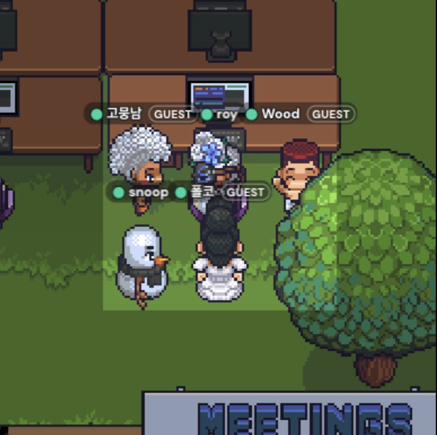
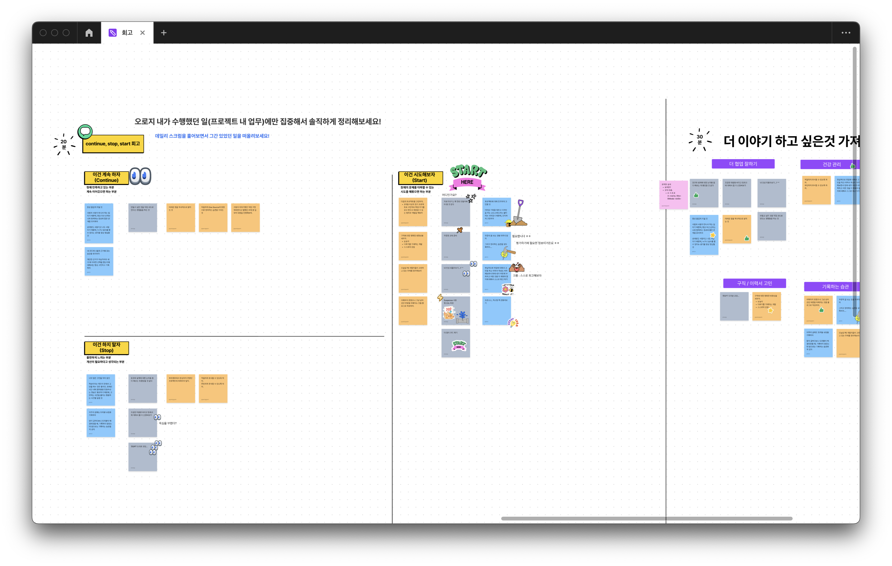

# 프로젝트 시작
6개월 동안 쉼없이 달려온 코드스쿼드 마지막 과정이 모두 끝났다. 특히 이번 프로젝트 마지막 한달 동안은 잠을 줄이고 불태우며 코드만 쳤던 것 같다. 팀원들 모두 4시까지 게더에 모여서 밤새 코드를 짤 정도로 팀 모두가 최선을 다해줬고 그래서 더 즐겁게 코딩할 수 있었던 것 같다!

(불타는 새벽 4시...!)

# 좋았던 점
1. 내가 코딩 하는 것을 정말 즐거워한다는 것을 깨달았다. 늦게까지 코드를 작성을 해도 정말 즐거웠다. 특히 팀원들도 의욕적으로 함께 해주어서 더 신나고 즐거웠던 것 같다. 협업에 대한 즐거움을 느낄 수 있었던 프로젝트였고 행복했다.
2. 코드스쿼드 이전과 비교할 때 확실히 성장했다. 코드스쿼드 이전에 나는 아주 기초적인 개념도 모르는 상태였기에 개발 팀원들의 이야기를 못 알아듣거나, 어떻게 코드를 개선해야 하는지 스스로 판단하기 어려웠다. 지금은 주도적으로 코드를 작성할 수 있게 되었으며 백엔드 팀원들과 커뮤니케이션할 때에도 (얄팍하지만) 어떻게 설계해야 할지 의견을 적극적으로 제시하며 프로젝트에 참여했다.
3. 속도감 있게 코드를 작성하는 것을 좋아하는 나와 스타일이 정반대인 포코와 함께 협업할 수 있어 반대로 배울 점이 많았다. 디버깅해도 답이 안나오고 막막할 때 포코와 함께 고민을 하며 문제를 해결했다. 포코의 코드를 꼼꼼하게 이해하는 습관을 나도 가져가야 겠다고 생각했다.
4. 리뷰어 빰빰이 실무자의 의견에서 적극적으로 여러 관점으로 코드를 리뷰해주셔서 감사했다. 사실 회사와 병행하며 이렇게 꼼꼼하게 리뷰를 해주시긴 힘들 것이라 생각했는데 마지막으로 함께 회고도 진행해주셔서 이 글의 글감을 별 어려움 없이 마련할 수 있었다. 아래는 회고를 했던 figjam 파일의 스크린샷.

# 아쉬운 점
1. 채팅을 구현하지 못한 점. 아쉽게도 채팅은 반 쪽짜리로 구현을 했다. 한달이라는 시간이 물리적으로 상당히 짧은 기간이였기에 채팅 쪽은 API 가 나오지 못했다. 하지만 나는 WebSocket을 정말 정말 사용해보고 싶었기에 남자친구를 졸라서 GPT 가 연동된 간단한 WebSocket API를 작성했고 채팅 상태는 local storage에 저장하는 무식한 방법(..) 을 써서 채팅을 시연에 성공할 수 있었다. 제대로 구현했다면 실시간 상태에 대해 깊게 고민해볼 수 있어 좋았을텐데 구현을 못한 것이 마음에 걸리고 아쉽다.
	[채팅 시연 영상](https://www.youtube.com/watch?v=XSe1uxe9kAM&embeds_widget_referrer=https%3A%2F%2Fsigridjin.medium.com%2Fbuilding-a-serverless-second-hand-marketplace-chatbot-using-aws-websocket-api-with-gpt-3-5-ded3f70f3935&embeds_referring_euri=https%3A%2F%2Fcdn.embedly.com%2F&embeds_referring_origin=https%3A%2F%2Fcdn.embedly.com&source_ve_path=MjM4NTE&feature=emb_title)
2. 포코와 프론트엔드 설계에 대한 논의에 시간을 많이 할애 하지는 못했던 점. 마지막 프로젝트는 구현에 대한 욕심을 부리느라 설계에 대한 고민을 많이 하지 못했다. 특히 포코는 설계에 대한 고민을 많이 하는 친구이기 때문에 같이 논의해보는 시간이 좀 더 길었더라면 나도 많이 배울 수 있었을텐데 그런 점이 아쉬웠다.

# 시도해볼 것
1. Suspense, Error Boundary를 이용한 상태 핸들링에 대해서 학습해보고 싶다. useEffect를 사용하니 조건문이 생겨 코드의 가독성이 상당히 떨어졌다. 이걸 익혀 적용하면 이 부분이 개선되지 않을까 하는데, 이번 프로젝트는 시도해보지 않았다. 조만간 공부를 해보자!
2. 웹 성능 측정 해보기. 웹 브라우저에서만 디버깅 했을때와 비교해 모바일에서 실행해보면 미묘하게 느리게 로딩되어, 생각보다 제품이 최적화되지 않았음을 깨닫게 되었다. 추후에 프로젝트 개선시 이 부분을 더 깊게 고민해볼 것이다.
3. 뒤늦게나마 React 공식 문서를 읽고 있는 중인데 이걸 왜 프로젝트 시작 전에 못읽었지? 하는 후회를 정말 많이 했다. 공식 문서를 제대로 읽고, 제대로 적용해보는게 큰 목표가 될 것이다.